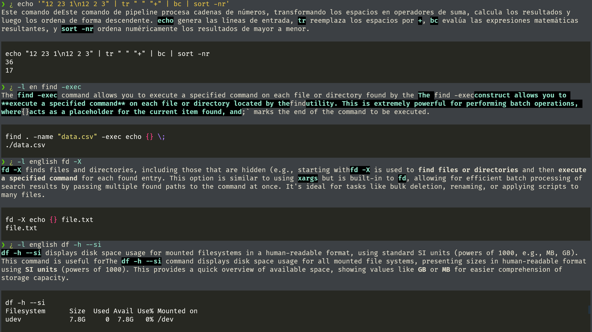

# AgentManu

## (AI) Agent Manual Helper for Unix Commands

AgentManu is a minimalist yet powerful AI assistant that explains `Unix` `commands`
in human-friendly terms. \
Similar to `tldr` but smarter and more flexible.

Powered by **Google Gemini** 2.5 (easily swappable for other models).

## Features

- Faster than man pages
- More flexible than `tldr` (with AI context awareness)
- Multi-language support (change output language on demand)
- Bash wrapper (¿) for quick queries
- Lightweight

## Requirements

It use [`uv`](https://github.com/astral-sh/uv) as project manager.

Add a `.env` file in the same folder with your Google API key:

```bash
GOOGLE_API_KEY="XXXXXXXXXXXXXXXXXXXXXXXXXXXXXXXXXXXXXXX"
```

## Installation

Clone the repository:
```bash
git clone git@github.com:uberkael/AgentManu.git
```

## Usage

Launch with [`uv`](https://github.com/astral-sh/uv):

```bash
uv run main.py <COMMAND and ARGS>
```

The output **language** can be changed using `-l`, `-lang`, `-i`, `--idiom`, `--language`
```bash
uv run main.py <COMMAND and ARGS>
```

It provides a bash wrapper command `¿` for asking about commands. \
(Due problems with the `?` character in `bash`, the wrapper was changed to `¿`)

```bash
# Make the bash wrapper executable
chmod +x "¿"
```

Launch with `?`:

```bash
¿ ls -l
¿ ps aux | grep
¿ watch 'ps aux | rg code'
...
```

## Example Output


Different languages, it can accept any.


More examples:

