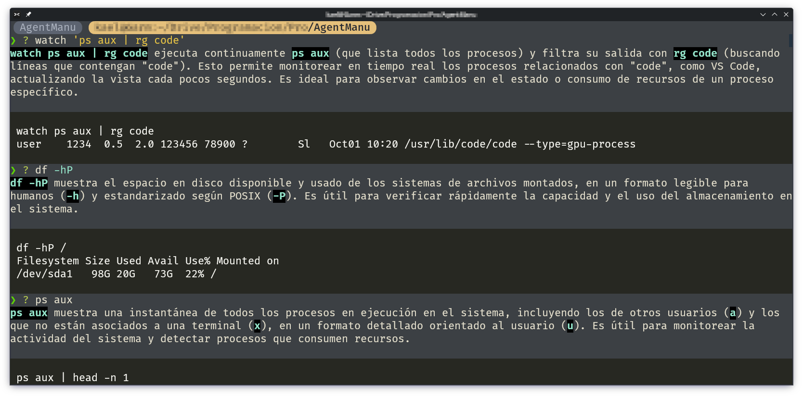
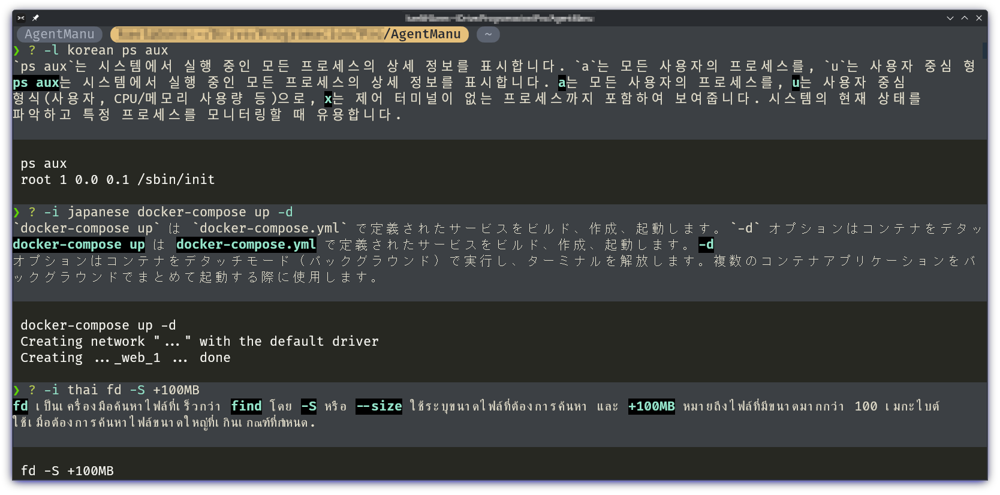

# AgentManu

## (AI) Agent Manual Helper for Unix Commands

AgentManu is an AI-powered assistant that explains `Unix` commands in a minimal, accurate, and human-friendly way.
Similar to tldr pages, but more flexible.

It uses **Google Gemini** but can be easily replaced for other models.

# Requirements

It use [`uv`](https://github.com/astral-sh/uv) as project manager.

# Installation

Clone the repository:
```bash
git clone git@github.com:uberkael/AgentManu.git
```

# Usage

Launch with [`uv`](https://github.com/astral-sh/uv):

```bash
uv run main.py <COMMAND and ARGS>
```

The output **language** can be changed using `-l`, `-lang`, `-i`, `--idiom`, `--language`
```bash
uv run main.py <COMMAND and ARGS>
```

It provides a bash wrapper command `?` for asking about commands.

```bash
# Make the bash wrapper executable
chmod +x "?"
```

Launch with `?`:

```bash
? ls -l
? ps aux | grep
? watch 'ps aux | rg code'
...
```


# Example Output



Different languages, it can accept any.

